# 配置账户生成SSH

## 1. 配置账户

在安装完Git首次使用之前，我们必须先配置Git的用户名和邮箱。然而为了避免重复配置，我们可以先查看当前的配置项，如果没有配置过，再进行配置。

### 1.1 查看Git配置项

```bash
# 查看所有生效配置
git config --list
git config --list --global

# 查看某个配置
git config --global user.name
git config --global user.email
```

如果没有配置过用户名和邮箱，查看配置项显示为空。此时，我们就要先配置用户名和邮箱。

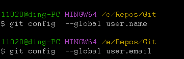

### 1.2 配置用户名和邮箱

```bash
# 配置用户名和邮箱
git config --global user.name "用户名"
git config --global user.email "邮箱"
```

配置完成后，可以再使用1.1节的命令来确认，看配置项是否有生效。

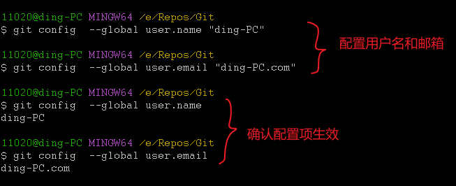

## 2. 生成SSH

Git本地安装和配置完成后，怎么和远程仓库（github）建立连接呢？通常使用SSH。

### 2.1 查看SSH

也许我们之前已经配置过SSH，这样就无需重复配置了。所以，在配置SSH之前我们先查看SSH。

```bash
# 列出~/.ssh目录下的文件
ls -al ~/.ssh
```

如果显示有`id_rsa`私钥或`id_rsa.pub`公钥，说明之前配置过SSH。如果没有配置过，会显示以下内容：

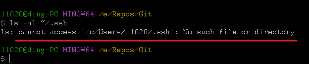

### 2.2 生成SSH密钥对

```bash
# 生成SSH密钥对，邮箱要换成自己的邮箱
ssh-keygen -t rsa -b 4096 -C "邮箱"
```

生成结束后，执行`ls -al ~/.ssh`确认结果。

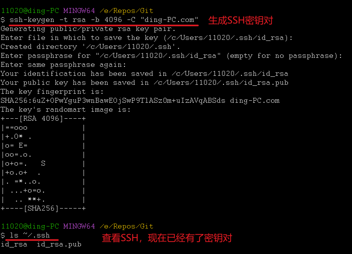

### 2.3 查看SSH密钥对内容

现在我们已经生成了SSH密钥对，来看下他们的内容。

#### 2.3.1 查看id_rsa.pub公钥内容

```bash
# 查看id_rsa.pub公钥内容
cat ~/.ssh/id_rsa.pub
```

结果：

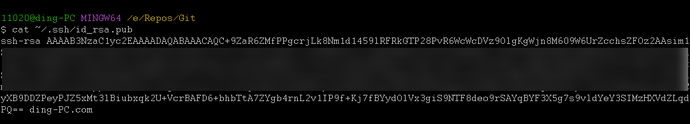

#### 2.3.2 查看id_rsa私钥内容

```bash
# 查看id_rsa私钥内容
cat ~/.ssh/id_rsa
```

结果。可以看到，私钥其实就是一个证书文件。

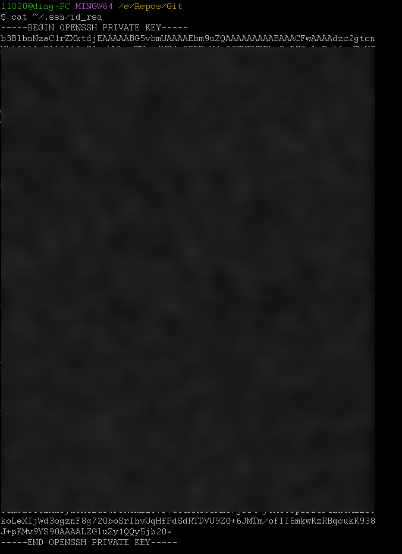

## 3. 连接Github代码平台（把公钥填进去）

现在我们已经配置好了SSH，怎么连接Github代码平台？很简单，我们需要向Github上传我们的公钥。

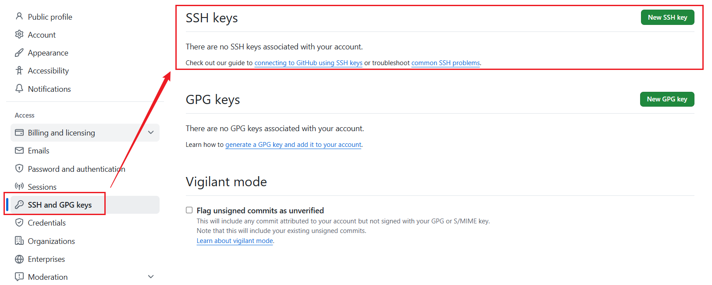

### 3.1 `cat ~/.ssh/id_rsa.pub`查看公钥

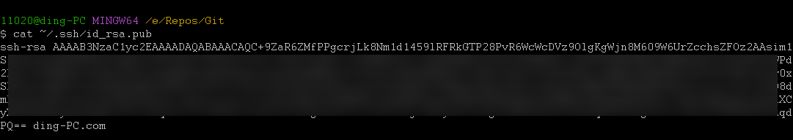

### 3.2 把公钥复制粘贴到Github的`SSH and GPL Keys`中

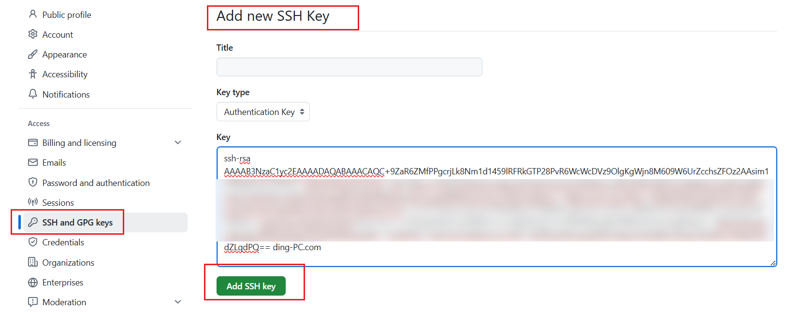

添加成功，显示如下：

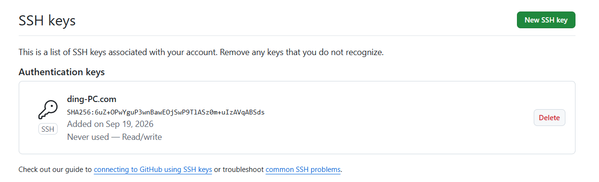

### 3.3 测试SSH连接

执行以下命令，测试是否能成功连接到Github平台

```bash
ssh -T git@github.com
```

显示以下信息，则说明配置成功

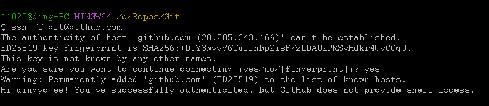

注意：如果我们连接到了Github平台，就会在`~/.ssh`目录下生成`known_hosts`文件保存，这样下次可以直接连，而不用每次都需要确认。

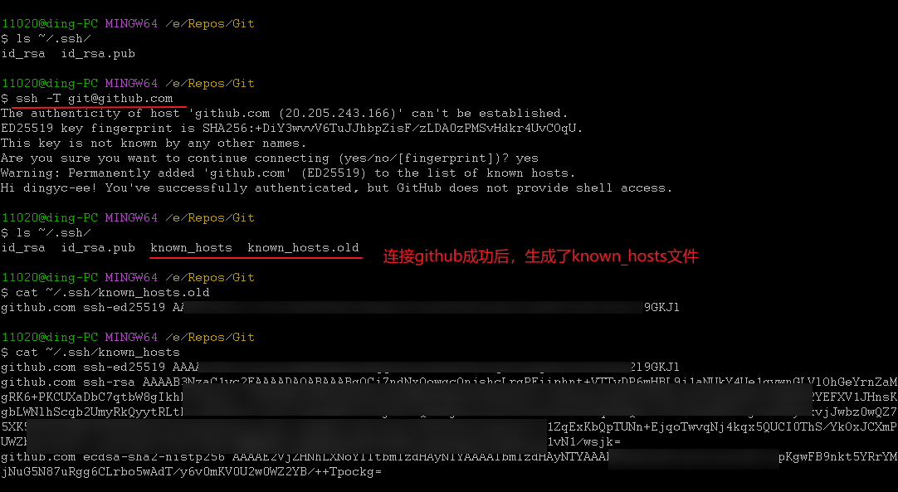

如果我们删除了这两个`known_hosts`文件，那下次连接Github又需要重新确认了。

## 4. 向Github提交代码

现在我们就可以向Github提交代码了。常规操作流程如下：

1. 在Github上创建仓库
2. 下载仓库到本地，上传代码后提交
3. 也可以直接把本地的代码关联到远程仓库，直接提交（我们重点学习这个）

### 4.1 创建仓库

我们首先在Github上创建一个仓库，填写仓库名和描述，其他的保持默认不动

这里可以看到：

+ 用户名：`ding-io`
+ 仓库名：`GitStudy`

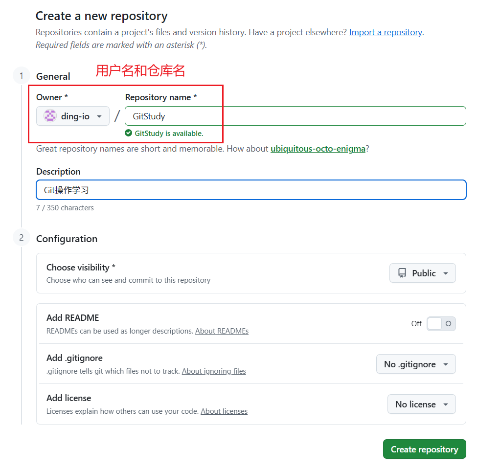

### 4.2 把本地git仓库关联到远程仓库

其实创建完仓库后，Github就会有页面显示，教你怎么下载仓库到本地，或者把本地的代码关联到远程仓库

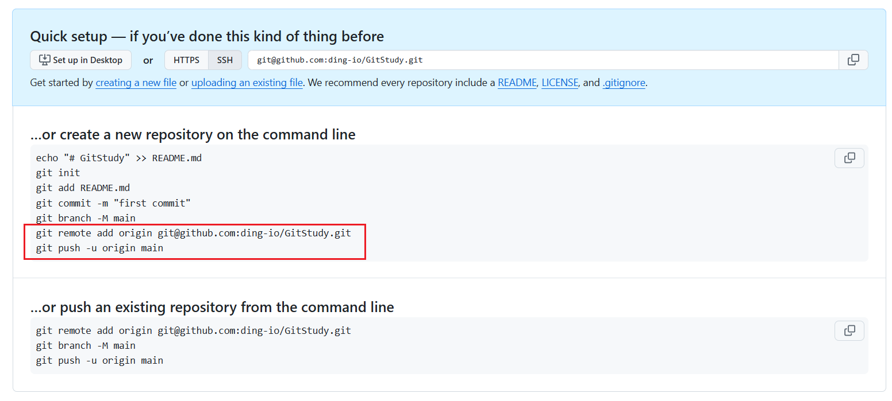

我们按照操作步骤来。有以下过程：

1. 我本地要初始化一个git仓库，commit提交一些文件
2. 把本地gi仓库关联到远程仓库。有2种方式：
    + SSH方式（推荐）：`git remote add origin git@github.com:用户名/仓库名.git`
    + HTTPS方式：`git remote add origin https@github.com:用户名/仓库名.git`
3. 把本地分支的提交推送到远程，并设置关联：`git push -u origin main`

